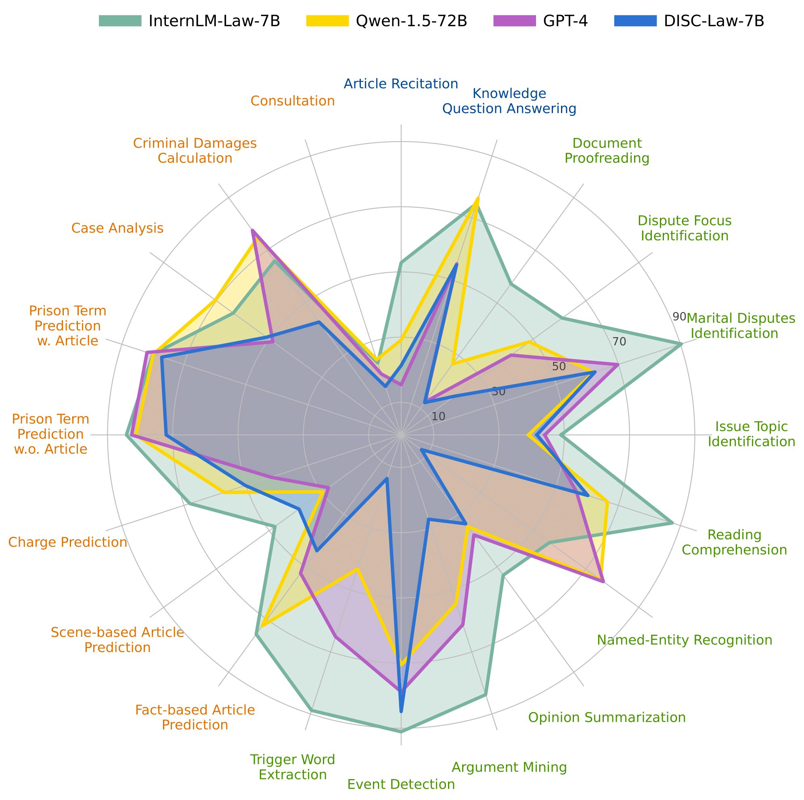
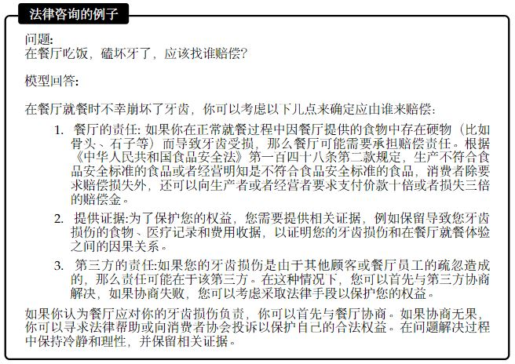
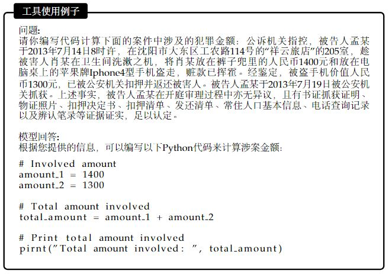

# InternLM-Law

A state-of-the-art Chinese Legal LLM. 

# Introduction
- **7B legal LLM with better than ChatGPT even GPT4 performances.**  InternLM-Law is SFT with ~2M high-quality and diversity supervised data based on the InternLM2-Chat model.  We adopt a two-stage supervised fine-tuning to balance both legal tasks performance and legal consultation performance. During training, we set the length to 32k to enable the model to handle long text in the legal field.
- **A model capable of utilizing tools to assist in resolving legal issues.** Our model is able to write Python code to solve numerical computation problems in the legal domain, thereby enhancing its accuracy on certain issues. Additionally, our model can integrate with existing popular frameworks to further improve its efficacy.
- **A legal large language model capable of serving multiple scenarios.** In the field of intelligent judiciary, there are various audiences. Our model is not only able to serve legal professionals but also caters to the general public. It can not only perform legal-related NLP (Natural Language Processing) tasks very well but also provide excellent legal consultation services. This enables it to integrate with various judicial systems and offer services to experts. At the same time, it can also provide legal consulting services to ordinary users, catering to the needs of different clients.

# Models

Coming soon......

# Performance

We present the results of our model on LawBench, which is a comprehensive dataset designed to systematically test the judicial capabilities of large language models. It consists of 20 tasks that analyze the legal prowess of large language models across three cognitive dimensions: memory, understanding, and application. 

| Models             | Model Type | Memorization | Understanding | Application | Avg  |
| ------------------ | ---------- | ------------ | ------------- | ----------- | ---- |
| GPT4               | General  | 35.29/36.01 | 54.41/56.48 | 54.05/55.01 | 52.35/53.85 |
| Qwen-1.5-7B        | General    | 19.16/19.00 | 39.19/43.62 | 49.75/50.40 | 41.41/43.87 |
| InternLM2-Chat-7B  | General    | 31.62/32.02 | 45.00/48.33 | 50.33/52.91 | 45.80/48.53 |
| Qwen-1.5-72B    | General    | 52.77/50.06 | 52.16/54.92 | 61.24/62.28 | 55.85/57.38 |
| Lawyer-LLaMA-13B | Legal      | 17.77/11.82 | 18.94/18.89 | 35.19/30.99 | 25.32/23.02 |
| ChatLaw-13B | Legal | 21.63/22.69 | 28.21/30.22 | 41.23/38.13 | 32.76/32.63 |
| DISC-Law-7B | Legal | 38.05/37.02 | 36.43/38.07 | 48.94/53.14 | 41.60/43.99 |
| **InternLM-Law(Ours)** | Legal | **63.72/64.95** | **71.81/71.58** | **63.57/63.46** | **67.71/67.67** |

## Human Evaluation
We consider a challenging version of the LC task where the user queries are open-ended (i.e., they do not have a model answer). Due to the lack of a model answer, it is no longer possible to conduct an automatic evaluation. Human evaluation is performed to assess these answers from five aspects: (1) Relevance, (2) Correctness, (3) Clarity, (4) Fluency, and (5) Detail. We chose GPT-4 as the baseline, and we compared the responses of these legal models with those from GPT-4 to calculate their win rate over the baseline model.

| Model            | win rate |
| ---------------- | -------- |
| Lawyer-LLaMA     | 0.0      |
| ChatLaw          | 0.0      |
| DISC-Law         | 25       |
| **InternLM-Law** | **67.5** |

## Long Context Performance

We have constructed a legal long-text evaluation dataset, which focuses on a common task for judges during their work: reading and analyzing judgment documents. These documents often contain critical information, but some are extensive in length, making it challenging to extract pertinent details. Our dataset is designed to assess the ability of models to accurately recall relevant information from these lengthy legal texts. To enable the model to input these lengthy legal texts, we employ the LMDeploy inference engine to allow the model to accept such ultra-long text inputs. We demonstrate the performance of the publicly available legal model in recalling extensive legal text information.

| Model            | F1 score  |
| ---------------- | --------- |
| Lawyer-LLaMA     | N/A       |
| ChatLaw          | N/A       |
| DISC-Law         | 36.72     |
| **InternLM-Law** | **84.73** |

# Examples

We present examples of our model on legal consultation and an example of writing code to calculate the amount involved in a crime.

Our model exhibits superior performance in responding to legal consultation queries compared to other models in terms of reply style. It generates well-structured and organized responses, capable of citing relevant legal provisions, and it can speculate on possible scenarios, providing detailed analysis. In contrast, other large language models tend to offer overly brief responses without analyzing potential situations, leading to subpar user experiences.

Interestingly, our model do not have any training data for solving monetary calculations in the legal domain using Python during its training. However, our model transfer its general ability to write code to solve problems over to tackling legal domain issues. It can solve criminal financial calculation issues within the legal field by utilizing Python code.

Here, we are merely showcasing the capabilities of our large language model as a foundational model. It can integrate with popular frameworks such as LangChain and LAgent for improved use. We strongly recommend that users build a retrieval database suited to their use cases when using the model. This will not only effectively enhance the accuracy of the model's responses but also enable it to better fulfill your tasks.

# Fine-tune and others
Please refer to [InternLM](https://github.com/InternLM/InternLM/tree/main) and [XTuner](https://github.com/InternLM/xtuner).

# Known issues
Despite our considerable efforts to reduce hallucinations and some unreal content in our model's output, like other large language models, it still can produces inaccurate information. Therefore, we strongly recommend that users employ popular Retrieval-Augmented Generation frameworks in conjunction with our model to improve the factuality of response.

